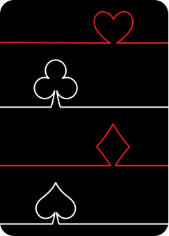

# Blackjack Game

A beautiful and interactive Blackjack game implemented in Python using Pygame. Play against the dealer with a realistic card interface and smooth gameplay.



## Features

- 🎮 Graphical user interface with beautiful card designs
- 🎲 Multiple deck support (default: 6 decks)
- 🃏 Realistic card graphics for all suits and ranks
- 🎯 Standard Blackjack rules implementation
- 🎨 Smooth animations and intuitive controls
- 🔄 New game functionality
- 💫 Fallback text-based cards if images are unavailable

## Requirements

- Python 3.11 or higher
- Pygame

## Installation

1. Clone the repository:
```bash
git clone https://github.com/rourennoe/blackjack_buisness.git
cd blackjack_buisness
```

2. Install the package in development mode:
```bash
pip install -e .
```

## How to Play

1. Run the game:
```bash
python -m game.main
```

2. Generate the strategy probability table:
```bash
# macOS/Linux
PYTHONPATH=src python -m game.generate_strategy_table

# Windows PowerShell
$env:PYTHONPATH='src'; python -m game.generate_strategy_table
```

Make sure you run this command from the repository root where the `src` directory exists.

This command writes `strategy_table.html` at the repository root.

3. Run the desktop training drill:

The training GUI requires `pygame` to be installed.

```bash
# macOS/Linux
PYTHONPATH=src python -m game.train_gui

# Windows PowerShell
$env:PYTHONPATH='src'; python -m game.train_gui
```

When the GUI starts, choose or create a user. Each user has a folder under `save/<username>` where their `training_history.txt` and `training_errors.txt` are stored.

This starts an interactive training GUI that shows a situation, validates your choice, and records results in `training_history.txt` and `training_errors.txt`.

4. Run the web training site:
```bash
# macOS/Linux
PYTHONPATH=src python -m game.web_api

# Windows PowerShell
$env:PYTHONPATH='src'; python -m game.web_api
```

Then open `http://127.0.0.1:8000`.

### Security notes for web deployment

- The web app is server-side only (no access to your local PC files from clients).
- User inputs are sanitized and validated.
- API endpoints are rate-limited.
- Strict security headers are set (CSP, X-Frame-Options, X-Content-Type-Options, Referrer-Policy, Permissions-Policy).
- Do **not** commit local session files (`save/`, `training_history.txt`, `training_errors.txt`) or `.env` files.

5. Game Controls:
   - Click "Hit" to draw another card
   - Click "Stand" to keep your current hand
   - Click "New Game" to start a fresh game

6. Game Rules:
   - Try to get as close to 21 as possible without going over
   - Face cards (J, Q, K) are worth 10
   - Aces are worth 11 or 1, whichever benefits you more
   - Beat the dealer's hand to win!

## Project Structure

```
blackjack_buisness/
├── src/
│   └── game/          # Main package directory
│       ├── __init__.py
│       ├── main.py              # Main game loop and GUI
│       ├── card.py             # Card class implementation
│       ├── deck.py             # Single deck implementation
│       └── multiple_deck.py    # Multiple deck handling
├── images/
│   └── cards/          # Card image assets
└── pyproject.toml      # Project configuration and dependencies
```

## Classes

- `Card`: Represents a playing card with suit, rank, and image
- `Deck`: Manages a standard 52-card deck
- `Multiple_deck`: Handles multiple decks for casino-style play
- `BlackjackGame`: Main game logic and GUI implementation

## Credits

Card images are from a modified version of Grafik-fighter's deck, optimized for game projects. The original design can be found [here](https://www.sketchappsources.com/free-source/3060-cards-deck-template-sketch-freebie-resource.html).

## Contributing

Feel free to contribute to this project by:
1. Forking the repository
2. Creating your feature branch
3. Committing your changes
4. Pushing to the branch
5. Opening a Pull Request

## License

This project is open source and available under the MIT License.